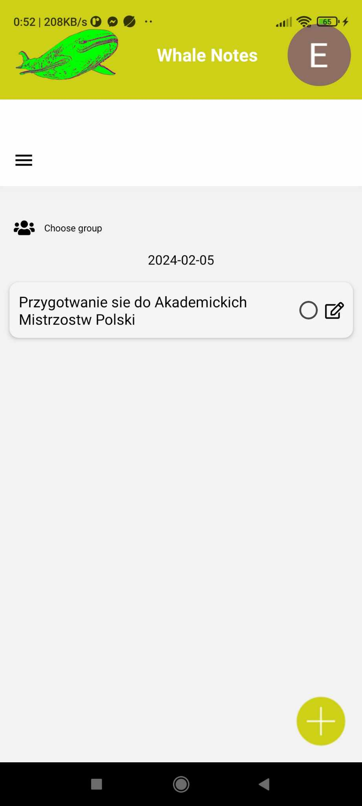
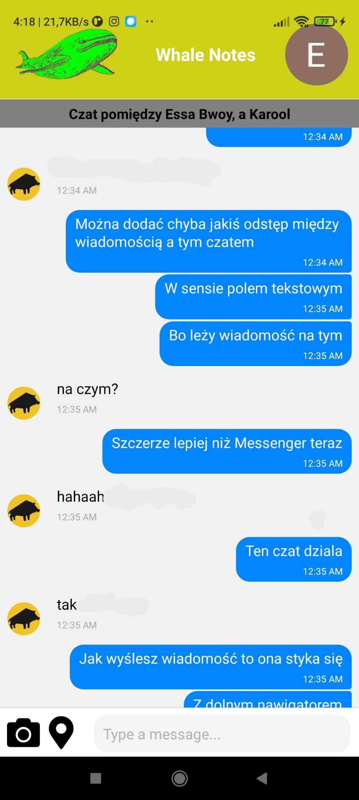
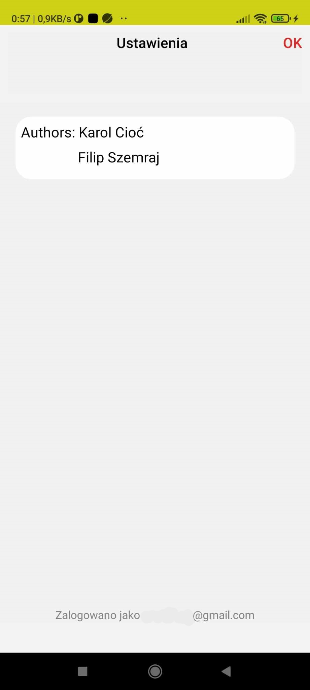

# ToDoApp mobile application
Realised as part of project classes during studies.
At this moment, we need to fix localization and a bug related to generating a high number of reads in Firebase. Additionally, the overall design of the app will be changed.

The application is used for:

- Managing tasks belonging to specific individuals and groups,
- Communicating between users and user groups.
The application is intended not only for individual users but also for groups of people who want to manage tasks and communicate with each other. 

The login system is provided through react-native-google-signin. All data is stored in Cloud Firestore, except for images which are uploaded to and retrieved from Firebase Storage.

The application provides:

- Adding new tasks including:
  - Entering the task name,
  - Setting the task priority,
  - Setting a reminder for a chosen time,
  - Selecting the day when the task is to be completed,
  - Adding a location pin.
- Deleting tasks.
- Modifying tasks.
- Displaying tasks based on their priority value.
- Displaying tasks from a selected calendar day.
- Adding friends.
- Creating groups with friends.
- Communicating through chat with friends and having conversations within the entire group.
- Sending images between users and groups via chat.
- Sharing selected location in the form of a pin through chat.
All task management activities are available for individual users as well as groups, which can consist of several friends.
## Technologies

 - React Native expo
 - JS, CSS
 - Firebase

## Overview

 
 
 

 
 
 

 
 
 

 
 
 

 
 
 

 
 
 

 
 
 

 
 

